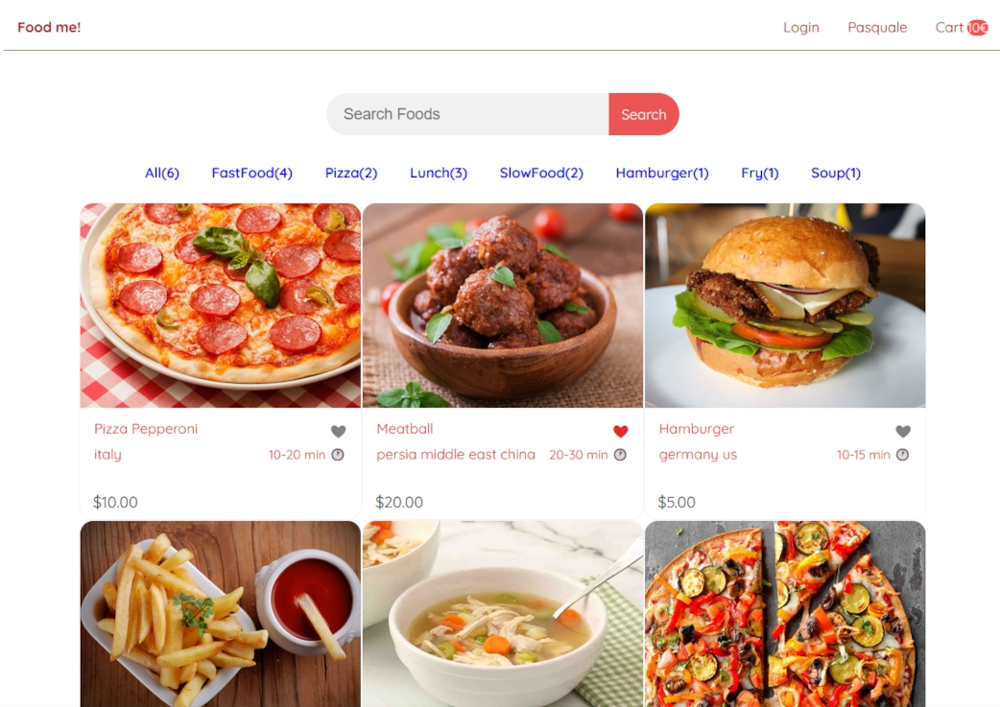

# Food me!
## Instructions
To launch the application:
1 - Download the entire project
2 - Make sure Node.js and Angular v19+ are installed
3 - Open any terminal, navigate to the frontend folder, and run "ng serve -o"

## Dev logs
1. App init
2. Header
3. Food cards, food data
4. Search component
5. Food Tags
6. Food page
7. Cart 1/2

